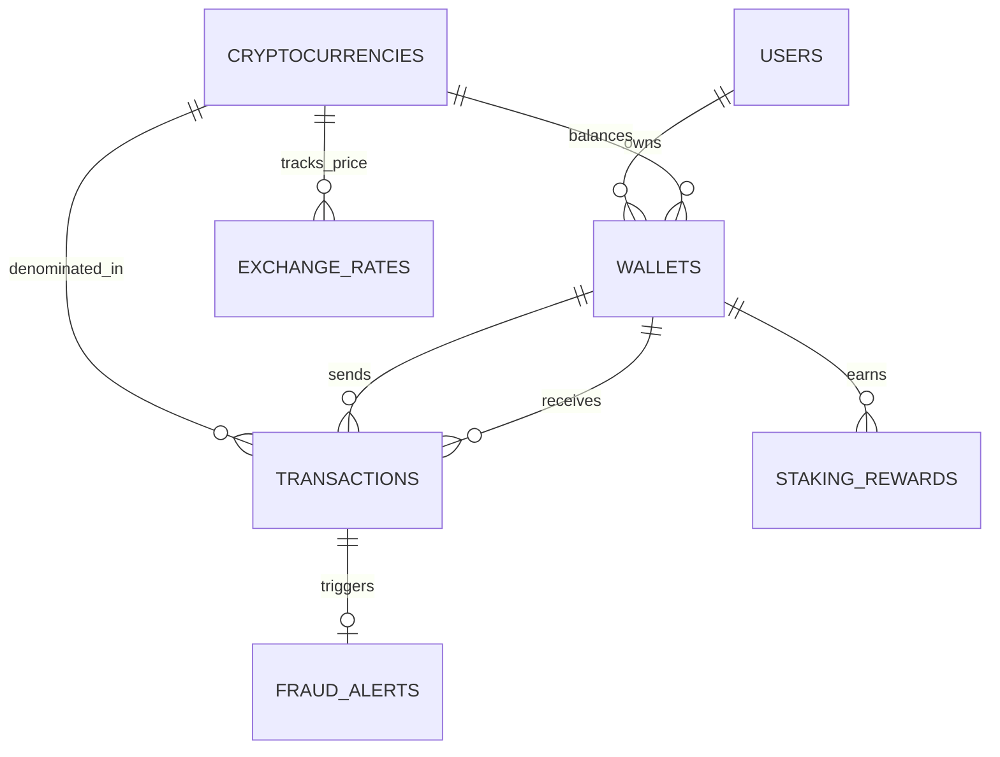
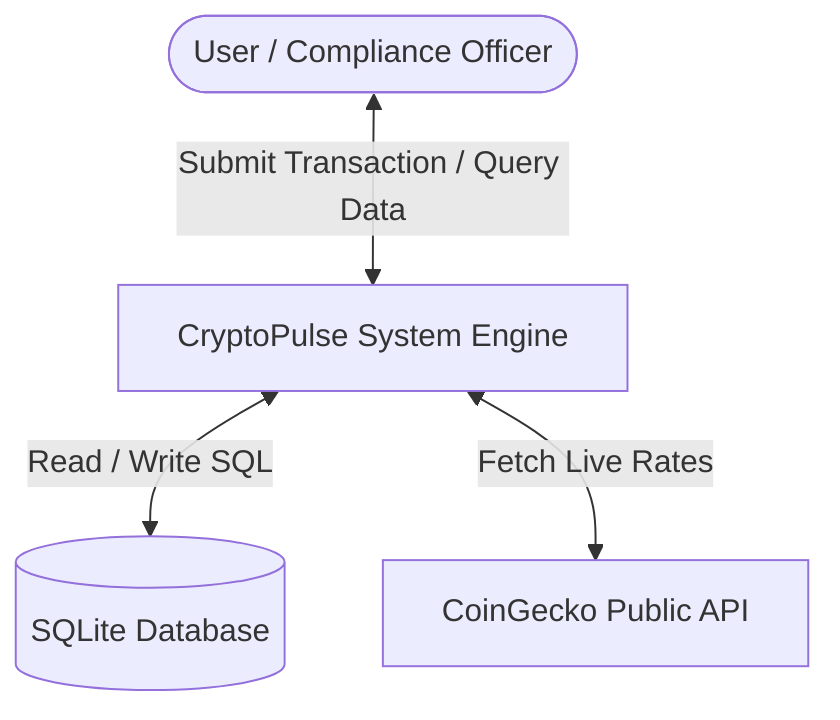

# 🎓 MAJOR PROJECT REPORT: CRYPTOPULSE
## Multi-Chain Cryptocurrency Transaction Tracker & Automated AML Risk Engine

---

## 📌 1. ABSTRACT
In recent years, the rapid growth of decentralized financial technologies and cryptocurrency adoption has led to massive volumes of multi-chain transactions. However, this decentralized nature presents major challenges regarding transaction visibility, portfolio valuation, gas fee accounting, and Anti-Money Laundering (AML) compliance. 

**CryptoPulse** is an enterprise-grade, full-stack database application designed to address these challenges. The system features a 3NF normalized relational database engine (SQLite), real-time portfolio valuation views, dynamic SQL triggers for automated high-value fraud detection, a statistical Machine Learning (ML) risk scoring engine, interactive SQL playground analytics, live market price synchronization via CoinGecko REST APIs, and official compliance audit certificate generation.

---

## 📋 2. SYSTEM REQUIREMENT SPECIFICATION (SRS)

### 2.1 Software Requirements
- **Operating System**: Windows 10/11 / macOS / Linux
- **Programming Language**: Python 3.8+
- **Web Framework**: Flask 3.x
- **Database Management System**: SQLite 3.x
- **Frontend Technologies**: HTML5, CSS3 (Tailwind CSS), JavaScript (ES6+), Chart.js
- **API Protocol**: RESTful JSON HTTP

### 2.2 Hardware Requirements
- **Processor**: Intel Core i3 / AMD Ryzen 3 or higher
- **RAM**: Minimum 4 GB (8 GB Recommended)
- **Disk Space**: 100 MB available storage

---

## 📐 3. DATABASE DESIGN & NORMALIZATION PROOF

The database is designed according to **Third Normal Form (3NF)** rules to prevent redundancy and update anomalies.

### 3.1 Normalization Steps
1. **First Normal Form (1NF)**: All column values are atomic (e.g., `user_id`, `wallet_address`, `price_usd`). No repeating groups exist.
2. **Second Normal Form (2NF)**: All non-key attributes are fully dependent on the primary key. `wallets` and `exchange_rates` are separated into distinct tables linked via Foreign Keys.
3. **Third Normal Form (3NF)**: Transitive dependencies are removed. Price tracking is decoupled into `exchange_rates` so `transactions` only reference `crypto_id`.

---

## 📊 4. ENTITY-RELATIONSHIP (ER) DIAGRAM

---

## 🔄 5. DATA FLOW DIAGRAMS (DFD)

### 5.1 DFD Level 0 (Context Diagram)

---

## 💻 6. SYSTEM MODULES

1. **User & Wallet Management Module**: Manages user KYC compliance and multi-chain wallet address generation (`0x...`).
2. **Transaction Ledger & Execution Module**: Processes transfers, deposits, withdrawals, and swaps with automatic gas fee estimation.
3. **Machine Learning Risk & AML Engine**: Calculates a dynamic Risk Score (0-100) based on Z-score volume anomaly, transfer velocity (< 5 mins), and KYC penalties.
4. **SQL Trigger Audit Log Module**: Database trigger (`trg_detect_large_transactions`) automatically inserts an alert into `fraud_alerts` whenever a transaction exceeds **$100,000**.
5. **Interactive SQL Playground Module**: Browser-based console executing real SELECT/CTE queries with live tabular results.
6. **Live Market Price Sync Module**: Synchronizes live crypto prices from CoinGecko REST API into `exchange_rates`.
7. **Compliance Audit Certificate Module**: Generates formal printable HTML/PDF audit compliance reports.

---

## 🧪 7. TEST CASES & VERIFICATION

| Test Case ID | Test Scenario | Expected Outcome | Result |
| :--- | :--- | :--- | :--- |
| **TC-01** | Database Initialization | Tables created with FK constraints enabled | **PASSED** |
| **TC-02** | User Portfolio Calculation | View `vw_user_portfolio` correctly calculates USD worth | **PASSED** |
| **TC-03** | Triggering $100k+ Transaction | `trg_detect_large_transactions` logs row into `fraud_alerts` | **PASSED** |
| **TC-04** | Rapid Transfer Velocity Test | Self-JOIN CTE query identifies transactions < 5 minutes apart | **PASSED** |
| **TC-05** | Live API Price Sync | CoinGecko API updates `exchange_rates` | **PASSED** |
| **TC-06** | SQL Playground Execution | SELECT queries return formatted JSON tables | **PASSED** |

---

## 🏁 8. CONCLUSION & FUTURE SCOPE
**CryptoPulse** successfully provides a robust, scalable, and high-performance database solution for tracking cryptocurrency transactions and ensuring financial compliance.

### Future Scope
- Integration with Ethereum JSON-RPC nodes (Web3.js / Ethers.js) for live blockchain block streaming.
- Deployment using Docker containers and PostgreSQL database clusters.
- Advanced neural network anomaly detection model for fraud prediction.
