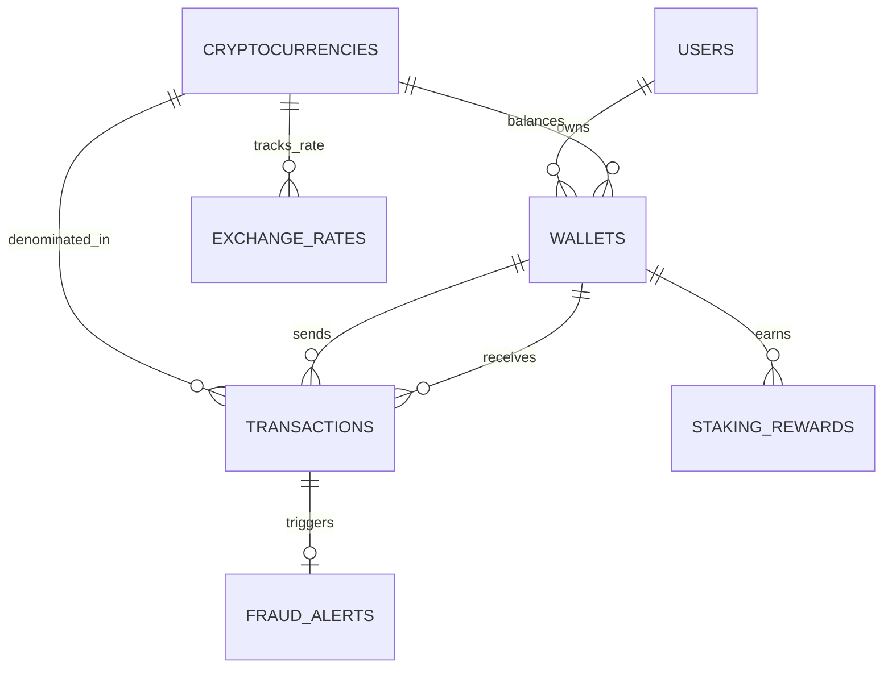

# 🪙 Cryptocurrency Transaction Tracker - SQL Analytics Project

A production-ready relational SQL database system designed to track multi-chain cryptocurrency transactions, wallet balances, historical exchange rates, staking rewards, gas fee expenditures, and anti-money laundering (AML) / fraud alerts.

---

## 📌 Features & Capabilities
- **Relational Schema Design**: 3NF normalized schema supporting Users, Multi-chain Wallets, Cryptocurrencies, Exchange Rates, Transactions, Staking, and Fraud Logs.
- **Real-Time Portfolio Valuation**: SQL Views (`vw_user_portfolio`) dynamically calculate net holdings and current USD valuation using historical market rates.
- **Automated Anti-Money Laundering (AML) Triggers**: Database trigger (`trg_detect_large_transactions`) automatically flags high-value transfers (> $100,000) into `fraud_alerts`.
- **Advanced SQL Analytics**: Uses Common Table Expressions (CTEs), Window Functions (`SUM() OVER`), Self-JOINs for rapid transfer velocity detection, and Aggregations.
- **Zero-Dependency Python Automation**: Includes `run_project.py` using SQLite's standard library to build, seed, and execute all queries with formatted terminal output.

---

## 📐 Entity-Relationship (ER) Diagram



---

## 🗂️ Database Schema Overview

| Table Name | Description | Key Fields & Constraints |
| :--- | :--- | :--- |
| `users` | User accounts and KYC status | `user_id` (PK), `username`, `email`, `kyc_status` |
| `cryptocurrencies` | Supported crypto assets | `crypto_id` (PK), `symbol`, `network`, `decimals` |
| `wallets` | Blockchain addresses owned by users | `wallet_id` (PK), `user_id` (FK), `wallet_address`, `wallet_type` |
| `exchange_rates` | Historical USD pricing logs | `rate_id` (PK), `crypto_id` (FK), `price_usd`, `recorded_at` |
| `transactions` | On-chain transfers, swaps, & deposits | `transaction_id` (PK), `tx_hash`, `sender_wallet_id`, `receiver_wallet_id`, `amount`, `gas_fee_usd` |
| `staking_rewards` | Yield staking contracts | `staking_id` (PK), `wallet_id` (FK), `staked_amount`, `apy_percentage` |
| `fraud_alerts` | Automated compliance audit logs | `alert_id` (PK), `transaction_id` (FK), `severity`, `alert_type` |

---

## 📊 Business & Analytics Queries Included

1. **User Portfolio Valuation**: Calculates dynamic user net worth across BTC, ETH, SOL, USDT.
2. **Whale Watcher**: Filters and converts largest transactions (> $50k) to USD in real-time.
3. **Cumulative Wallet Running Balance**: Uses Window Functions (`SUM() OVER`) to track ledger balance over time.
4. **Gas Fee Expenditure Leaderboard**: Summarizes network gas fees burned by users.
5. **Suspicious Activity Velocity Check**: Self-JOIN query flagging wallets executing multiple transactions in < 5 minutes.
6. **Staking Yield & APY Projections**: Calculates projected annual returns based on current crypto prices.
7. **Compliance Audit Alerts**: Inspects triggers generated for transactions exceeding $100,000.

---

## 🚀 How to Run the Project

### Prerequisites
- Python 3.8+ (Uses standard built-in `sqlite3` library, no `pip install` required!)

### Running the Project
```bash
python run_project.py
```

---

## 💼 Resume / Portfolio Project Description

> **Cryptocurrency Transaction & Fraud Analytics System (SQL / SQLite / Python)**
> - Designed a 3NF relational SQL database architecture for tracking multi-chain crypto transactions, exchange rates, and wallet balances.
> - Implemented SQL Triggers for automated risk management and fraud detection, flagging high-value transactions (> $100k) into audit logs.
> - Built complex analytical SQL queries incorporating CTEs, Window Functions (`SUM OVER`), and dynamic views for real-time portfolio valuation and transaction velocity analysis.
